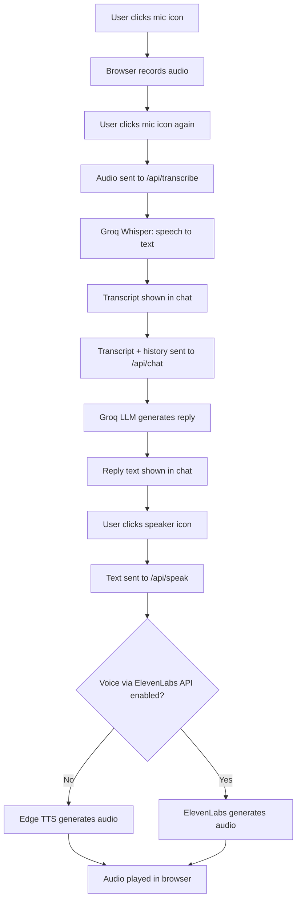

# Voice Agent

A push-to-talk voice AI assistant. The user records a question, the system
transcribes it, generates a text reply through an LLM, and can speak that
reply back on request. Built as a turn-based system (not a continuously
open microphone) so that every request completes within Vercel's
serverless execution limits.

## System Workflow



## Features

| Feature | Description | Notes |
|---|---|---|
| Push-to-talk recording | Click the mic icon to start recording, click again to stop | Uses the browser MediaRecorder API; no server connection held open while recording |
| Speech-to-text | Converts the recorded clip to a transcript | Groq `whisper-large-v3-turbo` |
| Conversational reply | Generates a text response from the transcript and prior turns | Groq `openai/gpt-oss-120b` |
| Tool calling | The LLM can call server-side tools when a query requires it | One example tool (`get_current_time`) is included; add more in `app/api/chat/route.ts` |
| On-demand speech playback | Converts a specific reply to audio only when its speaker icon is clicked | Prevents unnecessary API usage on replies the user does not listen to |
| Voice via ElevenLabs API | Toggle to use ElevenLabs instead of the default voice | Requires a usable ElevenLabs voice on the account; falls back to an error if none exists |
| Default voice | Free, unlimited text-to-speech used when the ElevenLabs toggle is off | Microsoft Edge TTS, via an unofficial public endpoint |
| Live input meter | Bar visualization reflecting microphone input while recording | Uses the Web Audio AnalyserNode; visual feedback only |

## Tech Stack

| Layer | Technology |
|---|---|
| Framework | Next.js 15 (App Router), React 19, TypeScript |
| Hosting | Vercel (Hobby tier) |
| Speech-to-text | Groq API, `whisper-large-v3-turbo` |
| Language model | Groq API, `openai/gpt-oss-120b` |
| Text-to-speech (default) | Edge TTS, via `edge-tts-universal` |
| Text-to-speech (optional) | ElevenLabs API, `eleven_multilingual_v2` |

## Environment Variables

| Variable | Required | Purpose |
|---|---|---|
| `GROQ_API_KEY` | Yes | Authenticates speech-to-text and chat requests |
| `ELEVENLABS_API_KEY` | Only if the ElevenLabs voice toggle is used | Authenticates text-to-speech requests to ElevenLabs |
| `ELEVENLABS_VOICE_ID` | Optional | Pins a specific ElevenLabs voice; if unset, the first voice found on the account is used |

## Local Setup

```bash
npm install
cp .env.example .env.local
# add GROQ_API_KEY (and optionally ELEVENLABS_API_KEY / ELEVENLABS_VOICE_ID) to .env.local
npm run dev
```

Open `http://localhost:3000` and allow microphone access when prompted.

## Deployment (Vercel, free tier)

1. Push the project to a GitHub repository.
2. Import the repository at vercel.com/new.
3. Add `GROQ_API_KEY` (and `ELEVENLABS_API_KEY` / `ELEVENLABS_VOICE_ID` if used)
   under Project Settings > Environment Variables.
4. Deploy. No additional configuration is required.

## Known Limitations

| Limitation | Detail |
|---|---|
| Not continuously listening | Each turn is record-then-stop, not an always-open microphone; a persistent, interruptible voice call would require a non-serverless backend |
| Groq rate limits | Free tier is capped at a fixed number of requests per day and tokens per minute |
| ElevenLabs free tier | Roughly 10,000 characters per month; cannot use Voice Library voices via the API, only a voice created on the account |

## Future Improvements

| Improvement | Description |
|---|---|
| Download chat | Export the full transcript, along with any generated reply audio, as a single downloadable file |
| Streaming responses | Stream the LLM reply as it generates instead of waiting for the full response |
| Conversation persistence | Save conversations across sessions instead of resetting on page reload |
| Additional tools | Expand the tool-calling set beyond the current example tool |
| Continuous listening mode | A persistent, interruptible voice session, requiring a non-serverless backend |
